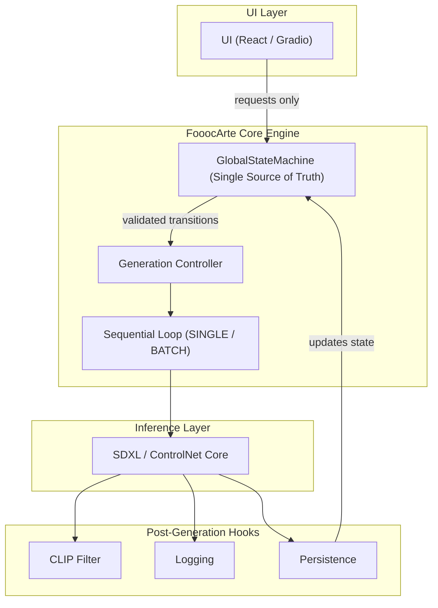
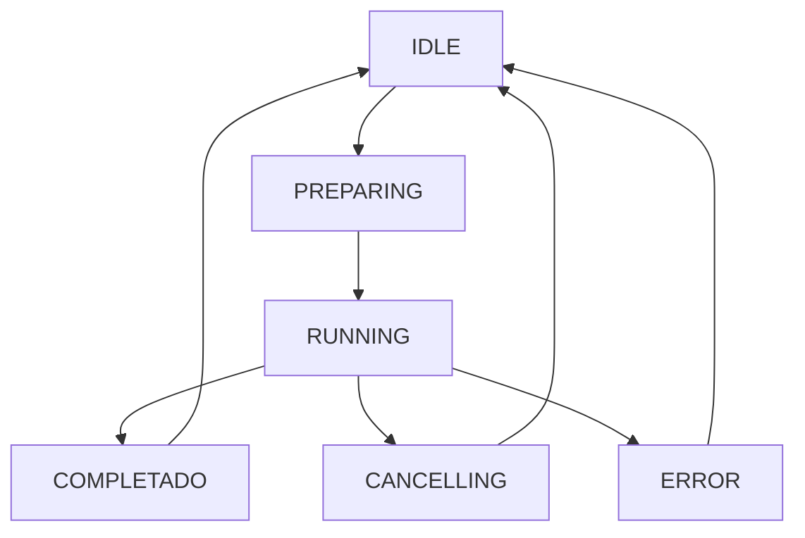

# FooocArte Architecture Overview

## Visual Architecture Model

### Modelo de Operación

**Core-driven / State-first / Single-pipeline**

### 🔑 Claves del Diseño

- **La UI nunca toca GPU**: Toda la lógica de inferencia está aislada en el Core.
- **El estado nunca vive en la UI**: El motor de estados en Python es el único dueño de la verdad.
- **El loop no paraleliza**: Garantiza estabilidad y predictibilidad en la gestión de VRAM.
- **El pipeline no se duplica**: Arquitectura limpia sin fragmentación de procesos.

## Unified Core Design

FooocArte replaces the fragmented logic of Fooocus with a centralized package structure located in `fooocarte/`.

### 📂 Directory Hierarchy

- **`core/state/`**: The heart of the system.
  - `GlobalStateMachine`: Manages `IDLE`, `PREPARING`, `RUNNING`, `CANCELLING`, `ERROR`.
  - `Transitions`: Specialized engine logic and thread-safe operations (RLock).
- **`core/generation/`**:
  - `generator.py`: Atomic unit of generation (`generate_once`).
  - `loop.py`: Orchestrates sequential execution.
- **`core/persistence/`**:
  - `storage.py`: Atomic JSON writing for `state.json` and `config.json`.
  - `recovery.py`: Logic to detect and resume interrupted sessions.
- **`core/quality/`**:
  - `clip_filter.py`: Scoring engine for output validation.
- **`ui/bindings/`**:
  - `state_binding.py`: Maps engine states to Gradio component updates.

## State Machine Lifecycle

## Resilience and Persistence

The system performs an **atomic sync** of the global state after every successful generation tick. This ensures that even in the event of a hard crash (OOM, Power Loss), the session can be resumed from the very next image index.
